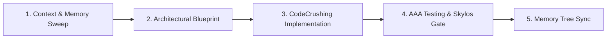

# OpenHuman Supercoder Operating Rule

When tackling any engineering, implementation, or refactoring task:

## 1. 🧠 OpenHuman 5-Stage Supercoding Pipeline (MANDATORY)

Execute tasks through the 5-stage pipeline:

1. **Stage 1: Context & Memory Sweep**
   - Read the project's **Memory Tree** (`.agents/memory/decisions.md`, `gotchas.md`, `goals.md`).
   - Honor established architecture invariants and avoid known gotchas before proposing changes.

2. **Stage 2: Architectural Blueprint**
   - Design deep modules (minimal interface, rich functionality, clean seams).
   - Define type contracts and error domains before writing implementation files.

3. **Stage 3: High-Speed CodeCrushing**
   - Write clean, type-safe, production-ready code with comprehensive error handling.
   - Eliminate dead code, unused imports, and mock placeholders.

4. **Stage 4: AAA Testing & Skylos SAST Gate**
   - Write unit tests following **Arrange-Act-Assert (AAA)** pattern.
   - Run `skylos verify` on modified files to prevent AI hallucinations and dangerous dataflows.

5. **Stage 5: Memory Tree Sync**
   - Record durable decisions in `.agents/memory/decisions.md`.
   - Record platform gotchas and edge cases in `.agents/memory/gotchas.md`.
   - Update goal milestones in `.agents/memory/goals.md`.

## 2. ⚡ Autonomous Specialist Routing
When a task matches a specialized domain, activate the persona:
- **Architecture & Seams**: `@[openhuman]` / `codebase-design`
- **Frontend / Web**: `frontend-specialist` + `magic`
- **Backend / Database**: `backend-specialist` + `database-design`
- **SAST & Security**: `skylos`
