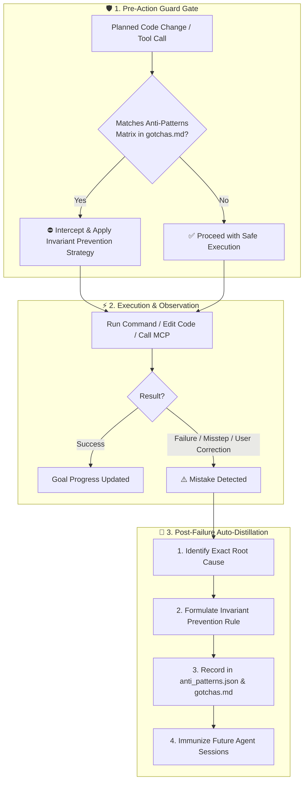

# 🧠 /learn: 2-Way Mistake Immunization & Learning Engine

The `/learn` workflow activates the persistent self-learning and anti-pattern immunization protocol across all agent operations.

---

## 🔄 The 2-Way Immunization Standard



---

## 🛠️ Developer & Agent CLI Commands

### 1. Inspect Learned Anti-Patterns
```bash
zg learn list
# or
python3 .agents/scripts/learn.py list
```

### 2. Record a Learned Rule
```bash
zg learn add \
  --mistake "Brief description of the failure" \
  --cause "Why the failure occurred" \
  --strategy "Proven solution to prevent repeating" \
  --category "tooling|runtime|architecture|agent_behavior" \
  --rule "Strict invariant rule"
```

### 3. Check Planned Actions for Known Anti-Patterns
```bash
zg learn check --query "command or feature planned"
```

### 4. Audit Memory Integrity
```bash
zg learn audit
```

---

## 🎯 Protocol Invariants
- **NEVER Repeat a Known Failure**: If an action was previously recorded in `.agents/memory/gotchas.md` or `anti_patterns.json`, you must reject the flawed approach before execution.
- **Immediate Distillation**: On encountering any unexpected error or user correction, do not simply retry blindly—distill the root cause and record the prevention rule before proceeding.
