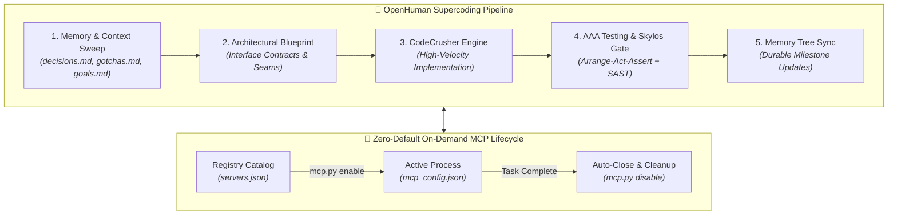

<div align="center">

# ⚡ ANTIGRAVITY SUPERCODER OS
### *Autonomous Multi-Agent Framework • 12 Production MCP Servers • 5-Stage Supercoder Engine*

[](https://github.com/nandha/agent/actions)
[](https://www.python.org/)
[](https://nodejs.org/)
[](https://modelcontextprotocol.io/)
[](https://github.com/duriantaco/skylos)
[](https://opensource.org/licenses/MIT)

<p align="center">
  <b>A unified, self-contained AI coding operating system equipped with 1,450+ specialized skills, persistent memory evolution, and zero-configuration one-click deployment.</b>
</p>

[Quick Start](#-quick-start) • [Architecture](#-architecture) • [MCP Servers](#-mcp-server-ecosystem) • [Slash Commands](#-slash-commands--workflows) • [Makefile](#-developer-tooling)

</div>

---

## 🌟 Highlights

- 🚀 **Ultra-Compact Production Installer (`install.sh`)**: High-efficiency self-extracting XZ executable compressed to **~1.3 MB** (down from 86MB). Unpacks, provisions isolated virtual environments, and configures tools with a single click.
- ⚡ **Zero-Default On-Demand MCP Architecture**: 0 background processes at startup. Servers are cataloged in `.agents/mcp-registry/servers.json`, dynamically activated when needed (`/mcp enable <name>` or `mcp.py`), and **automatically shut down** upon task completion.
- 🤖 **OpenHuman Supercoder Engine (`@[openhuman]`)**: 5-stage automated engineering pipeline (Context Sweep $\rightarrow$ Architecture Blueprint $\rightarrow$ CodeCrusher $\rightarrow$ AAA Testing & Skylos Gate $\rightarrow$ Memory Tree Sync).
- 🧠 **Persistent Memory Tree**: Invariant architecture decisions (`decisions.md`), platform gotchas (`gotchas.md`), and durable goal tracking (`goals.md`) that persist across agent sessions.
- 🔌 **12 Verified Production MCP Servers**: GitHub, Playwright, Supabase, Neon Postgres, Sentry, Chrome DevTools, Serena, Docker Gateway, Context7, Shadcn UI, Magic 21st.dev, and Skylos with STDIO stream isolation (`mcp-npx`).
- 🛡️ **Deterministic SAST & Zero-Slop**: Integrated local-first static analysis (`skylos`) to catch AI hallucinations, plus ADHD action-first formatting and human voice filters (`/no-ai-slop`).

---

## 📐 Architecture



---

## ⚡ Quick Start

### 1. One-Click Interactive Installation
Extract and configure everything for your current workspace and global Antigravity environment with a single command:

```bash
# Run 1.3 MB self-extracting installer
./install.sh
```

### 2. Non-Interactive / CI Flags
```bash
# Install both Local (.agents/) and Global (~/.gemini/config/)
./install.sh --all -y

# Install Global configuration only
./install.sh --global -y

# Deploy into a target workspace
./install.sh --target /path/to/project -y

# Dry-run / Simulation mode
./install.sh --dry-run --all
```

---

## 🔌 Zero-Default On-Demand MCP Manager

All 12 MCP servers start in a clean dormant state (`{}`). Activate them dynamically when needed and auto-close when done:

```bash
# List catalog & status
python .agents/scripts/mcp.py list

# Enable server(s) on demand
python .agents/scripts/mcp.py enable neon sentry

# Disable server(s) (kills background processes)
python .agents/scripts/mcp.py disable neon sentry

# Reset to zero-default clean profile
python .agents/scripts/mcp.py reset

# Run an ephemeral task with auto-shutdown
python .agents/scripts/mcp.py run neon -- python my_script.py
```

### Catalog of 12 Production Servers

| MCP Server | Category | Description |
|:---|:---|:---|
| **`context7`** | Documentation | Real-time library documentation resolver (Upstash Context7) |
| **`shadcn`** | Frontend | Direct Shadcn UI registry component discovery and addition |
| **`magic`** | Frontend | 21st.dev Magic UI design inspiration, component search & generation |
| **`skylos`** | Security | Local-first static analysis, SAST security scans & AI hallucination checks |
| **`github`** | VCS | GitHub issues, pull requests, repository search & automation |
| **`playwright`** | Testing | Headless browser automation, visual snapshots & E2E web testing |
| **`supabase`** | Database | Supabase project management, database migrations & SQL execution |
| **`neon`** | Database | Neon serverless Postgres branching, SQL queries & connection pooling |
| **`sentry`** | Observability | Sentry error telemetry, performance traces & crash diagnostic queries |
| **`chrome-devtools`** | Browser | Live Chrome DOM inspection, Lighthouse audits & performance traces |
| **`serena`** | Code Intelligence | Semantic AST symbol navigation, project memory & deep refactoring |
| **`docker-gateway`** | Containers | Docker container lifecycle, sandbox builds & image inspection |

---

## 💬 Slash Commands & Workflows

| Slash Command | File Location | Description |
|:---|:---|:---|
| **`/openhuman`** | [`.agents/workflows/openhuman.md`](.agents/workflows/openhuman.md) | Executes the 5-stage OpenHuman supercoding pipeline |
| **`/mcp`** | [`.agents/workflows/mcp.md`](.agents/workflows/mcp.md) | Dynamic on-demand MCP manager (enable, disable, list, auto-close) |
| **`/skylos`** | [`.agents/workflows/skylos.md`](.agents/workflows/skylos.md) | Runs local static analysis, security scan, or AI change verification |
| **`/i-have-adhd`** | [`.agents/workflows/i-have-adhd.md`](.agents/workflows/i-have-adhd.md) | Activates action-first, numbered steps and bounded cognitive output |
| **`/no-ai-slop`** | [`.agents/workflows/no-ai-slop.md`](.agents/workflows/no-ai-slop.md) | Strips 20+ patterns of AI slop while preserving human voice |
| **`/caveman`** | [`.agents/workflows/caveman.md`](.agents/workflows/caveman.md) | Cuts token usage by ~70% using telegraphic technical phrasing |
| **`/skill`** | [`.agents/workflows/skill.md`](.agents/workflows/skill.md) | Searches and loads instructions dynamically on demand |

---

## 🗂️ Persistent Memory Tree

Located in `.agents/memory/`:

```text
.agents/memory/
├── decisions.md       # Architectural decisions, invariants, design patterns
├── gotchas.md         # Framework quirks, known bugs, workarounds
└── goals.md           # Active milestones, sprint deliverables, completed goals
```

---

## 🛠️ Developer Tooling

```bash
make help             # View all available developer targets
make pack             # Bundle .agents/ into ultra-compact 1.3 MB install.sh
make install          # Install Local & Global suites
make check            # Run verification suite + Skylos SAST analysis
make test             # Validate MCP catalog, rules, and scripts
make mcp-list         # View on-demand MCP status
make mcp-enable s=... # Enable specific MCP server
make mcp-disable s=.. # Disable specific MCP server
make clean            # Remove caches, temporary logs, and build artifacts
```

---

## 📄 License

Distributed under the [MIT License](LICENSE). Built for high-velocity software engineering with Google Antigravity.
