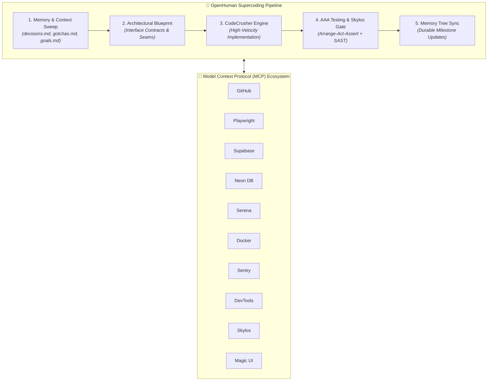

<div align="center">

# ⚡ ANTIGRAVITY SUPERCODER OS
### *Autonomous Multi-Agent Framework • 12 Production MCP Servers • 5-Stage Supercoder Engine*

[](https://github.com/nandha/agent/actions)
[](https://www.python.org/)
[](https://nodejs.org/)
[](https://modelcontextprotocol.io/)
[](https://github.com/duriantaco/skylos)
[](https://opensource.org/licenses/MIT)

<p align="center">
  <b>A unified, self-contained AI coding operating system equipped with 1,450+ specialized skills, persistent memory evolution, and zero-configuration one-click deployment.</b>
</p>

[Quick Start](#-quick-start) • [Architecture](#-architecture) • [MCP Servers](#-mcp-server-ecosystem) • [Slash Commands](#-slash-commands--workflows) • [Makefile](#-developer-tooling)

</div>

---

## 🌟 Highlights

- 🚀 **One-Click Self-Extracting Installer (`install.sh`)**: Single portable 22MB executable that unpacks, auto-provisions Python virtual environments, links binaries, and merges MCP configurations seamlessly for both Local and Global scopes.
- 🤖 **OpenHuman Supercoder Engine (`@[openhuman]`)**: 5-stage automated engineering pipeline (Context Sweep $\rightarrow$ Architecture Blueprint $\rightarrow$ CodeCrusher $\rightarrow$ AAA Testing & Skylos Gate $\rightarrow$ Memory Tree Sync).
- 🧠 **Persistent Memory Tree**: Invariant architecture decisions (`decisions.md`), platform gotchas (`gotchas.md`), and durable goal tracking (`goals.md`) that persist across agent sessions.
- 🔌 **12 Verified Production MCP Servers**: Out-of-the-box support for GitHub, Playwright, Supabase, Neon Postgres, Sentry, Chrome DevTools, Serena, Docker Gateway, Context7, Shadcn UI, Magic 21st.dev, and Skylos.
- 🛡️ **Deterministic SAST & Zero-Slop**: Integrated local-first static analysis (`skylos`) to catch AI hallucinations, plus ADHD action-first formatting and human voice filters (`/no-ai-slop`).

---

## 📐 Architecture



---

## ⚡ Quick Start

### 1. One-Click Interactive Installation
Extract and configure everything for your current workspace and global Antigravity environment with a single command:

```bash
# Run self-extracting installer
./install.sh
```

### 2. Non-Interactive / CI Flags
```bash
# Install both Local (.agents/) and Global (~/.gemini/config/)
./install.sh --all -y

# Install Global configuration only
./install.sh --global -y

# Deploy into a target workspace
./install.sh --target /path/to/project -y

# Dry-run / Simulation mode
./install.sh --dry-run --all
```

---

## 🔌 MCP Server Ecosystem

All 12 MCP servers are pre-configured with dynamic environment variable resolution (`${VAR}`) and verified healthy via STDIO handshakes:

| MCP Server | Runner / Command | Description |
|:---|:---|:---|
| **`github`** | `npx -y @modelcontextprotocol/server-github` | Issues, PRs, branch management, and repository automation |
| **`playwright`** | `npx -y @playwright/mcp` | Headless browser automation, scraping, and E2E testing |
| **`supabase`** | `npx -y @supabase/mcp-server-supabase` | Database migrations, table inspection, SQL, Edge functions |
| **`neon`** | `npx -y @neondatabase/mcp-server-neon` | Serverless Postgres branching, SQL execution, and connection pooling |
| **`sentry`** | `npx -y @sentry/mcp-server` | Error telemetry, performance traces, and issue diagnostics |
| **`chrome-devtools`** | `npx -y chrome-devtools-mcp` | Live DOM inspection, Lighthouse audits, network analysis |
| **`serena`** | `uvx serena start-mcp-server --open-web-dashboard false` | AST-aware code navigation, symbol refactoring, and memory |
| **`docker-gateway`** | `docker run -i --rm -v /var/run/docker.sock:... mcp/docker` | Container lifecycle, Dockerfile builds, and tool sandbox |
| **`context7`** | `npx -y @upstash/context7-mcp` | Real-time library documentation resolution (Upstash) |
| **`shadcn`** | `npx shadcn@latest mcp` | Direct Shadcn UI registry component discovery and installation |
| **`magic`** | `npx -y @21st-dev/magic@latest` | 21st.dev UI component search, inspiration, and generator |
| **`skylos`** | `/home/nandha/.local/share/skylos/venv/bin/python -m skylos_mcp` | Local-first SAST security scans, dead-code pruning, AI hallucination checks |

---

## 💬 Slash Commands & Workflows

| Slash Command | File Location | Description |
|:---|:---|:---|
| **`/openhuman`** | [`.agents/workflows/openhuman.md`](.agents/workflows/openhuman.md) | Executes the 5-stage OpenHuman supercoding pipeline |
| **`/skylos`** | [`.agents/workflows/skylos.md`](.agents/workflows/skylos.md) | Runs local static analysis, security scan, or AI change verification |
| **`/i-have-adhd`** | [`.agents/workflows/i-have-adhd.md`](.agents/workflows/i-have-adhd.md) | Activates action-first, numbered steps and bounded cognitive output |
| **`/no-ai-slop`** | [`.agents/workflows/no-ai-slop.md`](.agents/workflows/no-ai-slop.md) | Strips 20+ patterns of AI slop while preserving human voice |
| **`/caveman`** | [`.agents/workflows/caveman.md`](.agents/workflows/caveman.md) | Cuts token usage by ~70% using telegraphic technical phrasing |
| **`/skill`** | [`.agents/workflows/skill.md`](.agents/workflows/skill.md) | Searches and loads instructions from the 1,450+ offline skill catalog |

---

## 🗂️ Persistent Memory Tree

Located in `.agents/memory/`:

```text
.agents/memory/
├── decisions.md       # Architectural decisions, invariants, design patterns
├── gotchas.md         # Framework quirks, known bugs, workarounds
└── goals.md           # Active milestones, sprint deliverables, completed goals
```

---

## 🛠️ Developer Tooling

```bash
make help             # View all available developer targets
make pack             # Bundle .agents/ into self-extracting install.sh
make install          # Install Local & Global suites
make check            # Run verification suite + Skylos SAST analysis
make test             # Validate MCP servers, rules, and scripts
make clean            # Remove caches, temporary logs, and build artifacts
```

---

## 📄 License

Distributed under the [MIT License](LICENSE). Built for high-velocity software engineering with Google Antigravity.
