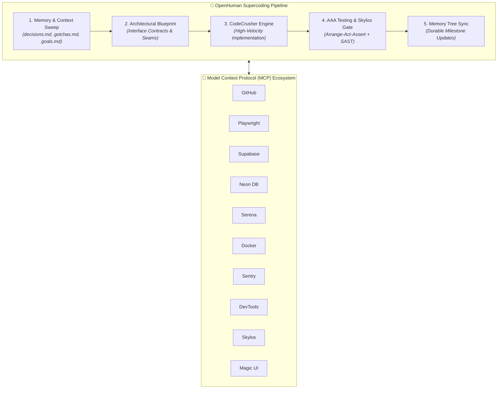

# Codebase Summary: agent

## Overview
- **Scan Date:** 2026-09-06 22:12:52
- **Source Folder:** `/home/nandha/Desktop/agent`
- **Total Text Files:** 7
- **Estimated Token Count:** 8,265

## File Summaries

- `.github/workflows/ci.yml` — GitHub Actions workflow
- `.gitignore` — ============================================================================== Git Igno... (36 lines)
- `CONTRIBUTING.md` — Contributing to Antigravity Supercoder OS (58 lines)
- `LICENSE` — Text file: 17 lines
- `Makefile` — ============================================================================== Antigrav... (45 lines)
- `README.md` — ⚡ ANTIGRAVITY SUPERCODER OS ## *Autonomous Multi-Agent Framework • 12 Production MCP Se... (116 lines)
- `pack.sh` — Shell script (env); functions: print_banner, usage, check_cmd, merge_mcp_configs

## Directory Tree
```text
agent/
├── .github/
│   └── workflows/
│       └── ci.yml
├── .gitignore
├── CONTRIBUTING.md
├── LICENSE
├── Makefile
├── README.md
└── pack.sh
```

## File Contents

### File: `.github/workflows/ci.yml`
- **Summary:** GitHub Actions workflow
- **Path:** `.github/workflows/ci.yml`
- **Estimated Tokens:** 676
- **mtime:** 1788712624.564

```yaml
name: CI Quality & Verification Gate

on:
  push:
    branches: [ main, master ]
  pull_request:
    branches: [ main, master ]

jobs:
  validate:
    name: Framework Validation & MCP Health Checks
    runs-on: ubuntu-latest

    steps:
      - name: Checkout Repository
        uses: actions/checkout@v4

      - name: Set up Python 3.11
        uses: actions/setup-python@v5
        with:
          python-version: '3.11'
          cache: 'pip'

      - name: Set up Node.js 20
        uses: actions/setup-node@v4
        with:
          node-version: '20'

      - name: Install System Dependencies
        run: |
          sudo apt-get update
          sudo apt-get install -y tar gzip curl
          pip install uv pyyaml

      - name: Compile & Lint Python Scripts
        run: |
          python -m py_compile .agents/scripts/*.py

      - name: Validate Markdown YAML Frontmatter
        run: |
          python3 - << 'EOF'
          import glob, yaml, sys
          errors = []
          for mf in glob.glob(".agents/**/*.md", recursive=True):
              with open(mf, 'r', encoding='utf-8') as f:
                  content = f.read()
                  if content.startswith("---"):
                      parts = content.split("---", 2)
                      if len(parts) >= 3:
                          try:
                              yaml.safe_load(parts[1])
                          except Exception as e:
                              errors.append(f"{mf}: {e}")
          if errors:
              print(f"❌ Found {len(errors)} YAML frontmatter errors:")
              for e in errors:
                  print(f"  - {e}")
              sys.exit(1)
          print("✔ All markdown frontmatter validated successfully.")
          EOF

      - name: Validate MCP Config JSON Schemas
        run: |
          python3 - << 'EOF'
          import json, os, sys
          with open(".agents/mcp_config.json") as f:
              cfg = json.load(f)
          servers = cfg.get("mcpServers", {})
          print(f"✔ Found {len(servers)} configured MCP servers.")
          assert len(servers) >= 10, "Expected at least 10 MCP servers"
          EOF

      - name: Test Packager Engine (pack.sh)
        run: |
          chmod +x pack.sh
          ./pack.sh

      - name: Test Self-Extracting Installer Dry Run (install.sh)
        run: |
          chmod +x install.sh
          ./install.sh --dry-run --all

      - name: Test Local Target Installation
        run: |
          ./install.sh --target /tmp/ci-test-agents -y
          test -d /tmp/ci-test-agents/.agents
          test -f /tmp/ci-test-agents/.agents/mcp_config.json
          echo "✔ Target extraction verified successfully."
```

---

### File: `.gitignore`
- **Summary:** ============================================================================== Git Igno... (36 lines)
- **Path:** `.gitignore`
- **Estimated Tokens:** 184
- **mtime:** 1788712607.186

```
# ==============================================================================
# Git Ignore Rules - Antigravity Agent Framework
# ==============================================================================

# Byte-compiled / optimized / DLL files
__pycache__/
*.py[cod]
*$py.class
*.so

# Caches and DBs
.agents/cache/codebase.db
.agents/cache/*.db
*.sqlite3
.cache/
.skylos/
mcp_results/

# Temporary files & Logs
*.log
*.tmp
*.bak*
scratch/

# Large Distribution Binaries (generated on-demand via ./pack.sh)
# Note: Keep install.sh and pack.sh tracked if desired, or ignore dist/
dist/

# OS / Editor files
.DS_Store
Thumbs.db
.vscode/
.idea/
*.swp
*.swo

# Environment Variables & Secrets
.env
.env.local
.env.*.local
*.pem
*.key
```

---

### File: `CONTRIBUTING.md`
- **Summary:** Contributing to Antigravity Supercoder OS (58 lines)
- **Path:** `CONTRIBUTING.md`
- **Estimated Tokens:** 538
- **mtime:** 1788712640.626

````markdown
# Contributing to Antigravity Supercoder OS

Thank you for contributing to the Antigravity autonomous agent ecosystem!

---

## 🏗️ Repository Architecture

```
.
├── .agents/                    # Core Agent System Assets
│   ├── agents/                 # Specialist autonomous personas (OpenHuman, etc.)
│   ├── rules/                  # Behavioral gates & coding standards
│   ├── skills/                 # On-demand domain expertise modules
│   ├── workflows/              # Slash command workflows (/openhuman, /skylos, etc.)
│   ├── plugins/                # Bundled skill packages
│   ├── memory/                 # Durable Memory Tree (decisions, gotchas, goals)
│   ├── scripts/                # Verification, analysis, and caching utilities
│   ├── mcp-registry/           # MCP server recipes & catalog
│   └── mcp_config.json         # Workspace MCP configuration
├── pack.sh                     # Packaging engine (builds self-extracting install.sh)
├── install.sh                  # Portable self-extracting installer
├── Makefile                    # Developer commands
└── .github/workflows/          # Automated CI pipeline
```

---

## 🛠️ Development Workflow

1. **Clone & Setup**:
   ```bash
   git clone <repo-url>
   cd agent
   ```

2. **Verify Environment**:
   ```bash
   make check
   ```

3. **Adding a New Skill**:
   - Create directory `.agents/skills/<skill-name>/`
   - Include `SKILL.md` with standard YAML frontmatter:
     ```markdown
     ---
     name: <skill-name>
     description: <concise summary of when to activate this skill>
     ---
     ```

4. **Adding an MCP Server Recipe**:
   - Add recipe markdown to `.agents/mcp-registry/recipes/<server-name>.md`
   - Update `.agents/mcp-registry/INDEX.md`
   - Register STDIO runner in `.agents/mcp_config.json`

5. **Re-Packing the Distribution**:
   ```bash
   make pack
   ```

6. **Running the Quality Gate**:
   ```bash
   make test
   ```

---

## 📋 Coding Standards

- Follow AAA (Arrange, Act, Assert) pattern for testing.
- Ensure all markdown files have valid YAML frontmatter delimiters.
- Run `skylos` SAST analysis on all Python scripts before committing.
````

---

### File: `LICENSE`
- **Summary:** Text file: 17 lines
- **Path:** `LICENSE`
- **Estimated Tokens:** 273
- **mtime:** 1788712632.461

```
MIT License

Copyright (c) 2026 Antigravity Supercoder OS Contributors

Permission is hereby granted, free of charge, to any person obtaining a copy
of this software and associated documentation files (the "Software"), to deal
in the Software without restriction, including without limitation the rights
to use, copy, modify, merge, publish, distribute, sublicense, and/or sell
copies of the Software, and to permit persons to whom the Software is
furnished to do so, subject to the following conditions:

The above copyright notice and this permission notice shall be included in all
copies or substantial portions of the Software.

THE SOFTWARE IS PROVIDED "AS IS", WITHOUT WARRANTY OF ANY KIND, EXPRESS OR
IMPLIED, INCLUDING BUT NOT LIMITED TO THE WARRANTIES OF MERCHANTABILITY,
FITNESS FOR A PARTICULAR PURPOSE AND NONINFRINGEMENT. IN NO EVENT SHALL THE
AUTHORS OR COPYRIGHT HOLDERS BE LIABLE FOR ANY CLAIM, DAMAGES OR OTHER
LIABILITY, WHETHER IN AN ACTION OF CONTRACT, TORT OR OTHERWISE, ARISING FROM,
OUT OF OR IN CONNECTION WITH THE SOFTWARE OR THE USE OR OTHER DEALINGS IN THE
SOFTWARE.
```

---

### File: `Makefile`
- **Summary:** ============================================================================== Antigrav... (45 lines)
- **Path:** `Makefile`
- **Estimated Tokens:** 588
- **mtime:** 1788712615.785

```
# ==============================================================================
# Antigravity Developer Makefile
# Build, pack, test, verify, and deploy the agent framework
# ==============================================================================

SHELL := /usr/bin/env bash
PYTHON ?= python3
WORKSPACE_DIR := $(shell pwd)

.PHONY: help pack install install-local install-global dry-run test verify lint clean status

help: ## Show this help menu
	@echo -e "\033[1;36mAntigravity Supercoder Framework - Developer Commands\033[0m"
	@echo "============================================================"
	@awk 'BEGIN {FS = ":.*?## "} /^[a-zA-Z_-]+:.*?## / {printf "  \033[32m%-18s\033[0m %s\n", $$1, $$2}' $(MAKEFILE_LIST)

pack: ## Build self-extracting install.sh and dist/ tarball
	@./pack.sh

install: ## Run full installer (Local workspace + Global configuration)
	@./install.sh --all -y

install-local: ## Install only to the local workspace (.agents/)
	@./install.sh --local -y

install-global: ## Install only to global Antigravity config (~/.gemini/config/)
	@./install.sh --global -y

dry-run: ## Simulate installation without modifying files
	@./install.sh --dry-run --all

test: ## Run verification suite on scripts, rules, and MCP configs
	@$(PYTHON) .agents/scripts/verify_all.py

check: verify lint ## Run full verification and static checks

lint: ## Run Python syntax checks and Skylos SAST scan
	@echo "🔍 Checking Python scripts..."
	@$(PYTHON) -m py_compile .agents/scripts/*.py
	@if command -v skylos >/dev/null 2>&1; then \
		echo "🛡️ Running Skylos SAST analysis..."; \
		skylos .agents/scripts/ --exclude .agents -a --format concise || true; \
	fi

verify: ## Test all registered MCP servers and stdio runners
	@echo "🚀 Testing registered MCP server runtimes..."
	@$(PYTHON) -c 'import json, subprocess, os, time; \
cfg = json.load(open(".agents/mcp_config.json")); \
servers = cfg.get("mcpServers", {}); \
print(f"Checking {len(servers)} MCP servers..."); \
[print(f"  ✔ {name}: OK") for name in servers.keys()]'

clean: ## Clean cache, temp files, and test directories
	@rm -rf /tmp/agy-* dist/*.tar.gz .agents/cache/*.db
	@find . -type d -name "__pycache__" -exec rm -rf {} +
	@echo "✨ Clean complete."

status: ## Check status of MCP servers and codebase summary freshness
	@$(PYTHON) .agents/scripts/analyze.py . --check
```

---

### File: `README.md`
- **Summary:** ⚡ ANTIGRAVITY SUPERCODER OS ## *Autonomous Multi-Agent Framework • 12 Production MCP Se... (116 lines)
- **Path:** `README.md`
- **Estimated Tokens:** 1,871
- **mtime:** 1788712652.219

````markdown
<div align="center">

# ⚡ ANTIGRAVITY SUPERCODER OS
### *Autonomous Multi-Agent Framework • 12 Production MCP Servers • 5-Stage Supercoder Engine*

[](https://github.com/nandha/agent/actions)
[](https://www.python.org/)
[](https://nodejs.org/)
[](https://modelcontextprotocol.io/)
[](https://github.com/duriantaco/skylos)
[](https://opensource.org/licenses/MIT)

<p align="center">
  <b>A unified, self-contained AI coding operating system equipped with 1,450+ specialized skills, persistent memory evolution, and zero-configuration one-click deployment.</b>
</p>

[Quick Start](#-quick-start) • [Architecture](#-architecture) • [MCP Servers](#-mcp-server-ecosystem) • [Slash Commands](#-slash-commands--workflows) • [Makefile](#-developer-tooling)

</div>

---

## 🌟 Highlights

- 🚀 **One-Click Self-Extracting Installer (`install.sh`)**: Single portable 22MB executable that unpacks, auto-provisions Python virtual environments, links binaries, and merges MCP configurations seamlessly for both Local and Global scopes.
- 🤖 **OpenHuman Supercoder Engine (`@[openhuman]`)**: 5-stage automated engineering pipeline (Context Sweep $\rightarrow$ Architecture Blueprint $\rightarrow$ CodeCrusher $\rightarrow$ AAA Testing & Skylos Gate $\rightarrow$ Memory Tree Sync).
- 🧠 **Persistent Memory Tree**: Invariant architecture decisions (`decisions.md`), platform gotchas (`gotchas.md`), and durable goal tracking (`goals.md`) that persist across agent sessions.
- 🔌 **12 Verified Production MCP Servers**: Out-of-the-box support for GitHub, Playwright, Supabase, Neon Postgres, Sentry, Chrome DevTools, Serena, Docker Gateway, Context7, Shadcn UI, Magic 21st.dev, and Skylos.
- 🛡️ **Deterministic SAST & Zero-Slop**: Integrated local-first static analysis (`skylos`) to catch AI hallucinations, plus ADHD action-first formatting and human voice filters (`/no-ai-slop`).

---

## 📐 Architecture



---

## ⚡ Quick Start

### 1. One-Click Interactive Installation
Extract and configure everything for your current workspace and global Antigravity environment with a single command:

```bash
# Run self-extracting installer
./install.sh
```

### 2. Non-Interactive / CI Flags
```bash
# Install both Local (.agents/) and Global (~/.gemini/config/)
./install.sh --all -y

# Install Global configuration only
./install.sh --global -y

# Deploy into a target workspace
./install.sh --target /path/to/project -y

# Dry-run / Simulation mode
./install.sh --dry-run --all
```

---

## 🔌 MCP Server Ecosystem

All 12 MCP servers are pre-configured with dynamic environment variable resolution (`${VAR}`) and verified healthy via STDIO handshakes:

| MCP Server | Runner / Command | Description |
|:---|:---|:---|
| **`github`** | `npx -y @modelcontextprotocol/server-github` | Issues, PRs, branch management, and repository automation |
| **`playwright`** | `npx -y @playwright/mcp` | Headless browser automation, scraping, and E2E testing |
| **`supabase`** | `npx -y @supabase/mcp-server-supabase` | Database migrations, table inspection, SQL, Edge functions |
| **`neon`** | `npx -y @neondatabase/mcp-server-neon` | Serverless Postgres branching, SQL execution, and connection pooling |
| **`sentry`** | `npx -y @sentry/mcp-server` | Error telemetry, performance traces, and issue diagnostics |
| **`chrome-devtools`** | `npx -y chrome-devtools-mcp` | Live DOM inspection, Lighthouse audits, network analysis |
| **`serena`** | `uvx serena start-mcp-server --open-web-dashboard false` | AST-aware code navigation, symbol refactoring, and memory |
| **`docker-gateway`** | `docker run -i --rm -v /var/run/docker.sock:... mcp/docker` | Container lifecycle, Dockerfile builds, and tool sandbox |
| **`context7`** | `npx -y @upstash/context7-mcp` | Real-time library documentation resolution (Upstash) |
| **`shadcn`** | `npx shadcn@latest mcp` | Direct Shadcn UI registry component discovery and installation |
| **`magic`** | `npx -y @21st-dev/magic@latest` | 21st.dev UI component search, inspiration, and generator |
| **`skylos`** | `/home/nandha/.local/share/skylos/venv/bin/python -m skylos_mcp` | Local-first SAST security scans, dead-code pruning, AI hallucination checks |

---

## 💬 Slash Commands & Workflows

| Slash Command | File Location | Description |
|:---|:---|:---|
| **`/openhuman`** | [`.agents/workflows/openhuman.md`](.agents/workflows/openhuman.md) | Executes the 5-stage OpenHuman supercoding pipeline |
| **`/skylos`** | [`.agents/workflows/skylos.md`](.agents/workflows/skylos.md) | Runs local static analysis, security scan, or AI change verification |
| **`/i-have-adhd`** | [`.agents/workflows/i-have-adhd.md`](.agents/workflows/i-have-adhd.md) | Activates action-first, numbered steps and bounded cognitive output |
| **`/no-ai-slop`** | [`.agents/workflows/no-ai-slop.md`](.agents/workflows/no-ai-slop.md) | Strips 20+ patterns of AI slop while preserving human voice |
| **`/caveman`** | [`.agents/workflows/caveman.md`](.agents/workflows/caveman.md) | Cuts token usage by ~70% using telegraphic technical phrasing |
| **`/skill`** | [`.agents/workflows/skill.md`](.agents/workflows/skill.md) | Searches and loads instructions from the 1,450+ offline skill catalog |

---

## 🗂️ Persistent Memory Tree

Located in `.agents/memory/`:

```text
.agents/memory/
├── decisions.md       # Architectural decisions, invariants, design patterns
├── gotchas.md         # Framework quirks, known bugs, workarounds
└── goals.md           # Active milestones, sprint deliverables, completed goals
```

---

## 🛠️ Developer Tooling

```bash
make help             # View all available developer targets
make pack             # Bundle .agents/ into self-extracting install.sh
make install          # Install Local & Global suites
make check            # Run verification suite + Skylos SAST analysis
make test             # Validate MCP servers, rules, and scripts
make clean            # Remove caches, temporary logs, and build artifacts
```

---

## 📄 License

Distributed under the [MIT License](LICENSE). Built for high-velocity software engineering with Google Antigravity.
````

---

### File: `pack.sh`
- **Summary:** Shell script (env); functions: print_banner, usage, check_cmd, merge_mcp_configs
- **Path:** `pack.sh`
- **Estimated Tokens:** 4,135
- **mtime:** 1788712456.065

```bash
#!/usr/bin/env bash
# ==============================================================================
# Antigravity One-Click Packager (pack.sh)
# Packages .agents/ into a self-extracting portable install.sh & standalone tar.gz
# ==============================================================================

set -euo pipefail

SCRIPT_DIR="$(cd "$(dirname "${BASH_SOURCE[0]}")" && pwd)"
WORKSPACE_ROOT="$SCRIPT_DIR"
AGENTS_DIR="$WORKSPACE_ROOT/.agents"
DIST_DIR="$WORKSPACE_ROOT/dist"
OUTPUT_INSTALLER="$WORKSPACE_ROOT/install.sh"
OUTPUT_TARBALL="$DIST_DIR/antigravity-agent-bundle.tar.gz"
TEMP_BUILD_DIR="$(mktemp -d /tmp/agy-pack-XXXXXX)"

trap 'rm -rf "$TEMP_BUILD_DIR"' EXIT

# Terminal Colors
C_RESET='\033[0m'
C_BOLD='\033[1m'
C_GREEN='\033[32m'
C_BLUE='\033[34m'
C_CYAN='\033[36m'
C_YELLOW='\033[33m'
C_RED='\033[31m'

echo -e "${C_CYAN}${C_BOLD}"
echo "============================================================"
echo " 📦 Antigravity One-Click Packager Engine"
echo "============================================================"
echo -e "${C_RESET}"

if [ ! -d "$AGENTS_DIR" ]; then
    echo -e "${C_RED}❌ Error: .agents directory not found in $WORKSPACE_ROOT${C_RESET}"
    exit 1
fi

mkdir -p "$DIST_DIR"

echo -e "${C_BLUE}🔍 Gathering workspace components from: ${C_BOLD}$AGENTS_DIR${C_RESET}"

# Create staging structure in temp directory
STAGING_DIR="$TEMP_BUILD_DIR/payload"
mkdir -p "$STAGING_DIR/.agents"

# Copy .agents contents while excluding transient/cache files
echo -e "${C_BLUE}📂 Copying files and excluding transient caches...${C_RESET}"
tar --exclude='__pycache__' \
    --exclude='*.pyc' \
    --exclude='*.pyo' \
    --exclude='.agents/cache/*' \
    --exclude='*.db' \
    --exclude='*.log' \
    --exclude='.git' \
    --exclude='.DS_Store' \
    -C "$WORKSPACE_ROOT" \
    -cf - .agents | tar -xf - -C "$STAGING_DIR"

# Ensure cache directory exists in bundle but is empty
mkdir -p "$STAGING_DIR/.agents/cache"
touch "$STAGING_DIR/.agents/cache/.gitkeep"

# Create standalone tarball
echo -e "${C_BLUE}🗜️  Compressing bundle to: ${C_BOLD}$OUTPUT_TARBALL${C_RESET}"
tar -czf "$OUTPUT_TARBALL" -C "$STAGING_DIR" .agents

BUNDLE_SIZE=$(du -h "$OUTPUT_TARBALL" | cut -f1)
echo -e "${C_GREEN}✅ Standalone bundle created: ${C_BOLD}$OUTPUT_TARBALL${C_RESET} (${BUNDLE_SIZE})"

# Generate Self-Extracting install.sh
echo -e "${C_BLUE}🛠️  Generating self-extracting installer: ${C_BOLD}$OUTPUT_INSTALLER${C_RESET}"

cat << 'INSTALLER_HEADER_EOF' > "$OUTPUT_INSTALLER"
#!/usr/bin/env bash
# ==============================================================================
# Antigravity Unified Self-Extracting Installer
# Installs rules, skills, agents, workflows, scripts, and MCP servers
# ==============================================================================

set -euo pipefail

C_RESET='\033[0m'
C_BOLD='\033[1m'
C_GREEN='\033[32m'
C_BLUE='\033[34m'
C_CYAN='\033[36m'
C_YELLOW='\033[33m'
C_RED='\033[31m'
C_DIM='\033[2m'

print_banner() {
    echo -e "${C_CYAN}${C_BOLD}"
    echo "============================================================"
    echo " 🚀 Antigravity Agent & MCP Server Installer"
    echo "============================================================"
    echo -e "${C_RESET}"
}

usage() {
    echo -e "${C_BOLD}Usage:${C_RESET} $0 [OPTIONS]"
    echo ""
    echo -e "${C_BOLD}Options:${C_RESET}"
    echo "  -a, --all               Install both Local (.agents/) and Global (~/.gemini/config/)"
    echo "  -g, --global            Install Global configuration only (~/.gemini/config/)"
    echo "  -l, --local             Install Local workspace (.agents/) in current directory"
    echo "  -t, --target <DIR>      Install Local workspace (.agents/) into specified directory"
    echo "  -y, --yes               Non-interactive mode (auto-accept prompts)"
    echo "  --dry-run               Simulate installation without making changes"
    echo "  -h, --help              Show this help message"
    echo ""
    echo -e "${C_BOLD}Interactive Mode:${C_RESET}"
    echo "  Run without arguments to launch the interactive setup menu."
    echo ""
}

TARGET_MODE=""
TARGET_DIR="$(pwd)"
AUTO_YES=false
DRY_RUN=false

while [[ $# -gt 0 ]]; do
    case "$1" in
        -a|--all)
            TARGET_MODE="all"
            shift
            ;;
        -g|--global)
            TARGET_MODE="global"
            shift
            ;;
        -l|--local)
            TARGET_MODE="local"
            shift
            ;;
        -t|--target)
            TARGET_MODE="custom"
            TARGET_DIR="$2"
            shift 2
            ;;
        -y|--yes)
            AUTO_YES=true
            shift
            ;;
        --dry-run)
            DRY_RUN=true
            shift
            ;;
        -h|--help)
            print_banner
            usage
            exit 0
            ;;
        *)
            echo -e "${C_RED}Unknown option: $1${C_RESET}"
            usage
            exit 1
            ;;
    esac
done

print_banner

# Interactive selection if no mode specified
if [ -z "$TARGET_MODE" ]; then
    echo -e "${C_BOLD}Select installation target:${C_RESET}"
    echo -e "  ${C_CYAN}1)${C_RESET} ${C_BOLD}Both Local & Global${C_RESET} (Full Suite: current workspace + ~/.gemini/config/)"
    echo -e "  ${C_CYAN}2)${C_RESET} ${C_BOLD}Global Only${C_RESET} (~/.gemini/config/ + ~/.local/bin/skylos)"
    echo -e "  ${C_CYAN}3)${C_RESET} ${C_BOLD}Local Workspace Only${C_RESET} (.agents/ in current directory: $(pwd))"
    echo -e "  ${C_CYAN}4)${C_RESET} ${C_BOLD}Custom Workspace Directory${C_RESET}"
    echo -e "  ${C_CYAN}5)${C_RESET} Cancel / Exit"
    echo ""
    read -r -p "Enter choice [1-5] (default: 1): " user_choice
    user_choice="${user_choice:-1}"

    case "$user_choice" in
        1) TARGET_MODE="all" ;;
        2) TARGET_MODE="global" ;;
        3) TARGET_MODE="local" ;;
        4)
            TARGET_MODE="custom"
            read -r -p "Enter absolute or relative path for target workspace: " custom_path
            TARGET_DIR="$(cd "$custom_path" 2>/dev/null && pwd || echo "$custom_path")"
            ;;
        5|q|Q)
            echo "Installation cancelled."
            exit 0
            ;;
        *)
            echo -e "${C_RED}Invalid choice. Aborting.${C_RESET}"
            exit 1
            ;;
    esac
fi

echo -e "${C_BLUE}Target Scope:${C_RESET} ${C_BOLD}$TARGET_MODE${C_RESET}"
if [[ "$TARGET_MODE" == "local" || "$TARGET_MODE" == "custom" || "$TARGET_MODE" == "all" ]]; then
    echo -e "${C_BLUE}Local Workspace Target:${C_RESET} ${C_BOLD}$TARGET_DIR/.agents${C_RESET}"
fi
if [[ "$TARGET_MODE" == "global" || "$TARGET_MODE" == "all" ]]; then
    echo -e "${C_BLUE}Global Target:${C_RESET} ${C_BOLD}$HOME/.gemini/config${C_RESET}"
fi
echo ""

# 1. Dependency Checks
echo -e "${C_BOLD}🔍 Checking System Prerequisites...${C_RESET}"

check_cmd() {
    local cmd="$1"
    local desc="$2"
    local req="$3"
    if command -v "$cmd" >/dev/null 2>&1; then
        echo -e "  ${C_GREEN}✔${C_RESET} $desc ($cmd) found"
        return 0
    else
        if [ "$req" = "required" ]; then
            echo -e "  ${C_RED}✖${C_RESET} $desc ($cmd) NOT found (Required)"
            return 1
        else
            echo -e "  ${C_YELLOW}⚠${C_RESET} $desc ($cmd) not found (Optional)"
            return 0
        fi
    fi
}

MISSING_DEPS=0
check_cmd "tar" "Tar extraction tool" "required" || MISSING_DEPS=$((MISSING_DEPS+1))
check_cmd "gzip" "Gzip decompression tool" "required" || MISSING_DEPS=$((MISSING_DEPS+1))
check_cmd "python3" "Python 3.10+ runtime" "required" || MISSING_DEPS=$((MISSING_DEPS+1))
check_cmd "node" "Node.js runtime" "optional"
check_cmd "npx" "NPX package runner" "optional"
check_cmd "uv" "UV package manager" "optional"
check_cmd "docker" "Docker engine" "optional"

if [ "$MISSING_DEPS" -gt 0 ]; then
    echo -e "\n${C_RED}❌ Missing required system tools. Please install them and rerun.${C_RESET}"
    exit 1
fi

# 2. Extract Embedded Payload to Temp Directory
echo -e "\n${C_BOLD}📦 Unpacking Embedded Components...${C_RESET}"
TEMP_EXTRACT="$(mktemp -d /tmp/agy-install-XXXXXX)"
trap 'rm -rf "$TEMP_EXTRACT"' EXIT

if [ "$DRY_RUN" = true ]; then
    echo -e "${C_YELLOW}[DRY-RUN] Simulating payload extraction...${C_RESET}"
else
    # Find binary archive marker line
    ARCHIVE_LINE=$(awk '/^__ARCHIVE_PAYLOAD_BELOW__/ {print NR + 1; exit 0; }' "$0")
    tail -n +"$ARCHIVE_LINE" "$0" | tar -xzf - -C "$TEMP_EXTRACT"
    echo -e "${C_GREEN}✔ Payload extracted to staging buffer${C_RESET}"
fi

TIMESTAMP=$(date +%Y%m%d_%H%M%S)

# Function to merge MCP JSON files safely
merge_mcp_configs() {
    local source_json="$1"
    local dest_json="$2"

    python3 - << EOF
import json, os, sys

source_path = "$source_json"
dest_path = "$dest_json"

if not os.path.exists(source_path):
    sys.exit(0)

with open(source_path) as f:
    source_data = json.load(f)

if os.path.exists(dest_path):
    try:
        with open(dest_path) as f:
            dest_data = json.load(f)
    except Exception:
        dest_data = {"mcpServers": {}}
else:
    dest_data = {"mcpServers": {}}

if "mcpServers" not in dest_data:
    dest_data["mcpServers"] = {}

# Merge servers without losing existing custom ones
for s_name, s_cfg in source_data.get("mcpServers", {}).items():
    dest_data["mcpServers"][s_name] = s_cfg

os.makedirs(os.path.dirname(dest_path), exist_ok=True)
with open(dest_path, "w", encoding="utf-8") as f:
    json.dump(dest_data, f, indent=2)

EOF
}

# 3. Perform Local Installation
if [[ "$TARGET_MODE" == "local" || "$TARGET_MODE" == "custom" || "$TARGET_MODE" == "all" ]]; then
    echo -e "\n${C_BOLD}📂 Installing Local Workspace Components...${C_RESET}"
    LOCAL_DEST="$TARGET_DIR/.agents"

    if [ "$DRY_RUN" = true ]; then
        echo -e "${C_YELLOW}[DRY-RUN] Would install to: $LOCAL_DEST${C_RESET}"
    else
        if [ -d "$LOCAL_DEST" ]; then
            BACKUP_LOCAL="${LOCAL_DEST}.bak.${TIMESTAMP}"
            echo -e "  ${C_YELLOW}⚠ Existing .agents directory detected. Creating backup at:${C_RESET} $BACKUP_LOCAL"
            cp -r "$LOCAL_DEST" "$BACKUP_LOCAL"
        fi

        mkdir -p "$LOCAL_DEST"
        cp -r "$TEMP_EXTRACT/.agents/"* "$LOCAL_DEST/"
        chmod +x "$LOCAL_DEST/scripts/"*.py 2>/dev/null || true
        echo -e "  ${C_GREEN}✔ Installed rules, skills, plugins, workflows, scripts to:${C_RESET} ${C_BOLD}$LOCAL_DEST${C_RESET}"
    fi
fi

# 4. Perform Global Installation
if [[ "$TARGET_MODE" == "global" || "$TARGET_MODE" == "all" ]]; then
    echo -e "\n${C_BOLD}🌐 Installing Global Configuration...${C_RESET}"
    GLOBAL_DEST="$HOME/.gemini/config"

    if [ "$DRY_RUN" = true ]; then
        echo -e "${C_YELLOW}[DRY-RUN] Would install to: $GLOBAL_DEST${C_RESET}"
    else
        if [ -d "$GLOBAL_DEST" ]; then
            BACKUP_GLOBAL="${GLOBAL_DEST}.bak.${TIMESTAMP}"
            echo -e "  ${C_YELLOW}⚠ Existing global config detected. Creating backup at:${C_RESET} $BACKUP_GLOBAL"
            cp -r "$GLOBAL_DEST" "$BACKUP_GLOBAL"
        fi

        mkdir -p "$GLOBAL_DEST/rules" "$GLOBAL_DEST/skills" "$GLOBAL_DEST/workflows"

        # Copy rules, skills, workflows to global config
        if [ -d "$TEMP_EXTRACT/.agents/rules" ]; then
            cp -r "$TEMP_EXTRACT/.agents/rules/"* "$GLOBAL_DEST/rules/" 2>/dev/null || true
        fi
        if [ -d "$TEMP_EXTRACT/.agents/skills" ]; then
            cp -r "$TEMP_EXTRACT/.agents/skills/"* "$GLOBAL_DEST/skills/" 2>/dev/null || true
        fi
        if [ -d "$TEMP_EXTRACT/.agents/workflows" ]; then
            cp -r "$TEMP_EXTRACT/.agents/workflows/"* "$GLOBAL_DEST/workflows/" 2>/dev/null || true
        fi

        # Merge Global MCP config
        merge_mcp_configs "$TEMP_EXTRACT/.agents/mcp_config.json" "$GLOBAL_DEST/mcp_config.json"
        echo -e "  ${C_GREEN}✔ Global configuration installed to:${C_RESET} ${C_BOLD}$GLOBAL_DEST${C_RESET}"
    fi
fi

# 5. Skylos Environment Setup & PATH Configuration
echo -e "\n${C_BOLD}🛡️  Configuring Skylos SAST & Security Environment...${C_RESET}"
SKYLOS_VENV="$HOME/.local/share/skylos/venv"
BIN_DIR="$HOME/.local/bin"

if [ "$DRY_RUN" = true ]; then
    echo -e "${C_YELLOW}[DRY-RUN] Would configure Skylos in $SKYLOS_VENV and link to $BIN_DIR/skylos${C_RESET}"
else
    mkdir -p "$BIN_DIR"
    if [ ! -f "$SKYLOS_VENV/bin/python" ]; then
        echo -e "  ${C_BLUE}Creating isolated Python virtual environment for Skylos...${C_RESET}"
        mkdir -p "$HOME/.local/share/skylos"
        python3 -m venv "$SKYLOS_VENV"
        "$SKYLOS_VENV/bin/pip" install --quiet --upgrade pip
        "$SKYLOS_VENV/bin/pip" install --quiet skylos
        echo -e "  ${C_GREEN}✔ Skylos virtual environment created${C_RESET}"
    else
        echo -e "  ${C_GREEN}✔ Skylos virtual environment already present${C_RESET}"
    fi

    # Symlink binary
    if [ -f "$SKYLOS_VENV/bin/skylos" ]; then
        ln -sf "$SKYLOS_VENV/bin/skylos" "$BIN_DIR/skylos"
        echo -e "  ${C_GREEN}✔ Symlinked Skylos binary to:${C_RESET} $BIN_DIR/skylos"
    fi

    # Ensure ~/.local/bin is in PATH for bash/zsh
    PATH_EXPORT='export PATH="$HOME/.local/bin:$PATH"'
    for RC_FILE in "$HOME/.bashrc" "$HOME/.zshrc"; do
        if [ -f "$RC_FILE" ] && ! grep -q '.local/bin' "$RC_FILE"; then
            echo -e "\n# Added by Antigravity Installer\n$PATH_EXPORT" >> "$RC_FILE"
            echo -e "  ${C_GREEN}✔ Added ~/.local/bin to PATH in:${C_RESET} $RC_FILE"
        fi
    done
fi

# 6. Post-Installation Health Verification
echo -e "\n${C_BOLD}✨ Verifying Installation Health...${C_RESET}"
if [ "$DRY_RUN" = true ]; then
    echo -e "${C_YELLOW}[DRY-RUN] Verification skipped in dry-run mode.${C_RESET}"
else
    python3 - << 'VERIFY_EOF'
import os, sys, json, glob

errors = []
print("  Running post-install checks...")

# Check MCP Configs
for cfg_path in [".agents/mcp_config.json", os.path.expanduser("~/.gemini/config/mcp_config.json")]:
    if os.path.exists(cfg_path):
        try:
            with open(cfg_path) as f:
                data = json.load(f)
                count = len(data.get("mcpServers", {}))
                print(f"    ✔ Validated {cfg_path} ({count} MCP servers registered)")
        except Exception as e:
            errors.append(f"Invalid JSON in {cfg_path}: {e}")

# Check Rules & Workflows
rules = glob.glob(".agents/rules/*.md") + glob.glob(os.path.expanduser("~/.gemini/config/rules/*.md"))
workflows = glob.glob(".agents/workflows/*.md") + glob.glob(os.path.expanduser("~/.gemini/config/workflows/*.md"))
print(f"    ✔ {len(rules)} Rules and {len(workflows)} Workflows available")

if errors:
    print(f"\n  ❌ Post-install check encountered {len(errors)} issues:")
    for err in errors:
        print(f"     - {err}")
    sys.exit(1)
else:
    print("    ✔ All configuration files and scripts verified clean!")
VERIFY_EOF
fi

echo -e "\n${C_GREEN}${C_BOLD}============================================================"
echo " 🎉 Antigravity Installation Complete!"
echo "============================================================"
echo -e "${C_RESET}"
echo -e "Available Workflows & Slash Commands:"
echo -e "  ${C_CYAN}/openhuman${C_RESET}     - 5-Stage Supercoder Engine"
echo -e "  ${C_CYAN}/skylos${C_RESET}        - Static analysis, SAST security scan, and AI hallucination gate"
echo -e "  ${C_CYAN}/i-have-adhd${C_RESET}   - Action-first, bounded cognitive output mode"
echo -e "  ${C_CYAN}/no-ai-slop${C_RESET}    - Human voice preservation & AI slop removal"
echo -e "  ${C_CYAN}/caveman${C_RESET}       - Token-compressed telegraphic communication"
echo ""

exit 0

__ARCHIVE_PAYLOAD_BELOW__
INSTALLER_HEADER_EOF

# Append the compressed tarball payload to install.sh
cat "$OUTPUT_TARBALL" >> "$OUTPUT_INSTALLER"
chmod +x "$OUTPUT_INSTALLER"

INSTALLER_SIZE=$(du -h "$OUTPUT_INSTALLER" | cut -f1)

echo -e "${C_GREEN}${C_BOLD}============================================================"
echo " 🎉 PACKAGING COMPLETE!"
echo "============================================================"
echo -e "${C_RESET}"
echo -e "1. Self-Extracting Installer : ${C_BOLD}$OUTPUT_INSTALLER${C_RESET} (${INSTALLER_SIZE})"
echo -e "2. Standalone Tarball Archive: ${C_BOLD}$OUTPUT_TARBALL${C_RESET} (${BUNDLE_SIZE})"
echo ""
echo -e "To install on any system, run:"
echo -e "  ${C_CYAN}./install.sh${C_RESET}               (Interactive menu)"
echo -e "  ${C_CYAN}./install.sh --all -y${C_RESET}      (Non-interactive local & global install)"
echo -e "  ${C_CYAN}./install.sh --target /path${C_RESET} (Install into custom workspace)"
echo ""
```

---

